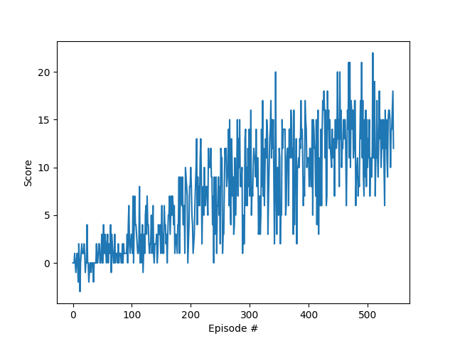

# Project 1: Navigation

## Learning Algorithm
This project uses Q-Learning to train an agent to interact with the Banana environment. Q-Learning involves using a neural network as a function approximator to estimate the Q-function (action value function). For this project the neural network is comprised of 6 dense/linear layers and 5 activation layers with the following sizes:

* `Dense`: 37x64
* `ReLU`: 64
* `Dense`: 64x128
* `ReLU`: 128
* `Dense`: 128x256
* `ReLU`: 256
* `Dense`: 256x128
* `ReLU`: 128
* `Dense`: 128x64
* `ReLU`: 64
* `Dense`: 64x4

All dense layers have biases. The final dense layer does not have a ReLU activation so that the action-value estimates can take on both positive and negative values.

# Plot of Rewards
The following hyperparameters were used to train the agent that obtained the following plot of scores:

* Number of Episodes: 2000
* Max Steps per Episode: 1000
* Initial Epsilon: 1.0
* Epsilon Decay: 0.995
* Minimum Epsilon: 0.01
* Alpha: 1.0
* Replay Buffer Size: 10000
* Batch size: 64
* Gamma (discount factor): 0.99
* Tau (soft update parameter): 0.001
* Learning Rate: 0.001
* Target Network Update Rate: 4 (train steps)
* Optimizer: RMSprop

## Ideas for Future Work
There is a very large number of parameters and hyperparameters to vary. 

All of the parmaeters/hyperparameters listed in the previous section could be varied to achieve faster convergence and/or a higher score. It would be interesting to use a hyperparameter optimizer to robustly search over the high-dimensional parameter-space.

For the model itself, the number of dense layers could be varied. It would be interesting to see how few lyaers are needed, or how few neurons per dense layer are needed to solve the environment. The model activations could also be adjusted. A parametric ReLU activation could be used to optimize the slope of the ReLU function. An ELU could be used to exponentially weight the higher activations. A Leaky ReLU could be applied after the final dense layer so that negative and positive values could have an activation applied.

Additionally, different Q-Learning algorithms could be used to achieve a more robust solution. A couple of easy modifications would be to use a Double Deep Q-Network and Prioritized Experience replay. These implementations would require very little changing of the base code and could lead to better results. The most robust approach would be to implement the Rainbow algorithm, which combines six Deep Q-Network alterations to achieve state-of-the-art performance.